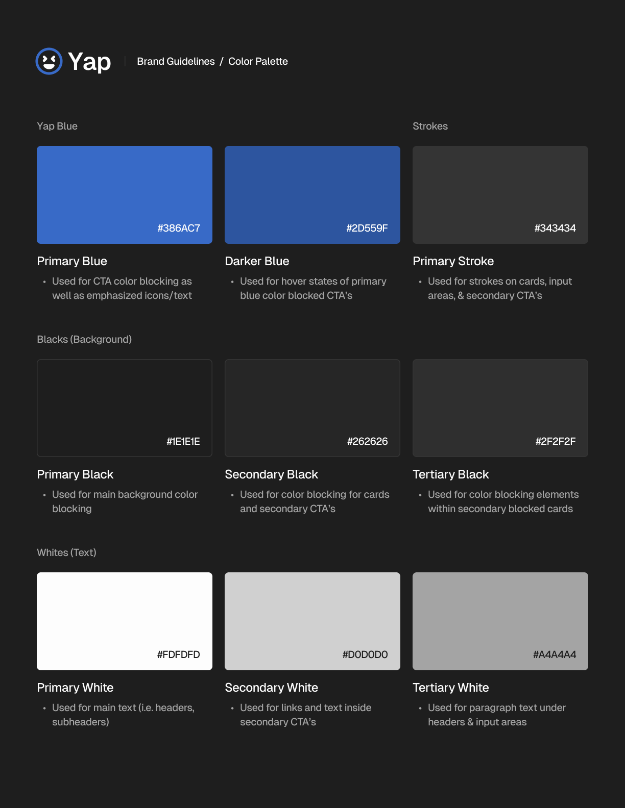

# Yap: Chat with your friends. Instantly.


## Setup Guide
Clone the repository using the following command:
```bash
git clone https://github.com/irvingywang/CS180-Team-Project.git
```
## How to Run
To run the program, simply run the main method of `App.java`. 
Try the login demo with username: `purduepete` and password: `123`.

## Submissions
- Phase 1: [Vocareum Submission]() - Irving Wang
- Phase 2: [Vocareum Submission]() - Irving Wang

# Class Descriptions
- `App`: Main class to run the program.
  - This class allows the user to interact with the program and decide their actions within the social
  - It will start a server and client, and then run the client GUI.

## Objects
- `UserInterface`: Interface for the User class.
  - This interface provides a framework for the User class.
  - This interface is crucial for ensuring the proper functionality and implementation of User.
- `User`: Represents a user of the social media platform.
  - This class provides functionalities such as storing various information about a user, allowing
  users to add or block others, and send and receive messages from others.
  - The methods "testUserCreationAndMessaging", "testCreateUserAndRetrieve", "testMessageCreation",
  "testMarkMessageAsRead", "testSendMessage", "testAddAndRemoveFriend", "testBlockUser", 
  "testSendMessageToBlockedUser", "testUnblockUser", and "testGetUsername" 
  all verify that this class is functional. 
  - Overall, this class can be combined with the others to allow the user of the messaging system to
  perform the various crucial actions that define a social media platform.
- `MessageInterface`: Interface for the Message class.
  - This interface provides a framework for the Message class.
  - This interface is crucial for ensuring the proper functionality and implementation of Message.
- `Message`: Represents a message on the social media platform.
  - This class provides functionalities such as storing various information about a message and getting
  information about the sender, receiver, and even time.
  - The methods "testUserCreationAndMessaging", "testMessageCreation", "testMarkMessageAsRead", 
  "testSendMessage", "testSendMessageToBlockedUser", and "testGetMessages" all verify that this 
  class is functional.
  - Overall, this class can be combined with the others to allow the messages of the system to store
  and deliver information that users want to use.
- `ChatInterface`: Interface for the chat class.
  - This interface provides a framework for the Chat class.
  - This interface is crucial for ensuring the proper functionality and implementation of Chat.
- `Chat`: Represents a chat which has a list of members and messages.
  - This class provides functionalities such as storing various information about a chat, like the users
  and messages getting sent.
  - The methods "testSendMessage", "testSendMessageToBlockedUser", and "testGetMessages" all verify 
  that this class is functional.
  - Overall, this class can be combined with the others to allow messages to be received and sent
  simultaneously.

## Database
- `DatabaseInterface`: Interface for the Database class.
  - This interface provides a framework for the Database class.
  - This interface is crucial for ensuring the proper functionality and implementation of 
- `Database`: Represents the database of the social media platform.
  - This class serves as a database management system for users, messages, and relationships. It provides
    functionalities to create, retrieve, update, and delete user data, as well as logging events and managing
    data persistence.
  - Its usage includes: - Creating a User: Use the createUser(username, password, displayName) method to
    create a new user. If a user with the same username already exists, the system logs an event. - Retrieving
    a User: Call the getUser(username) method to retrieve a user object based on the provided username. If the
    user does not exist, a new user object is returned. - Removing a User: Use the removeUser(username) method
    to remove a user from the  - Getting All Users: Call the getUsers() method to retrieve a list of
    all user Objects stored in the 
  - The methods "testUserCreationAndMessaging", "testCreateUserAndRetrieve", "testGetUserNotFound",
    and "setUp" all verify that this class is functional.
  - This is an integral part of our social media program as it stores all user information and distributes
    it accordingly.
- `DatabaseContainer`: Contains data to be used from database
  - This class serves as a collector for maintaining data, chats, and other user profile information
  - It's designed to be serialized, in order to better standardize the data collection of this app
- `LogType`: Enum to store the type of message.
  - This creates a new data type that stores the name of different messages that could be shown,
    such as info, error, and warning.
  - This program cannot really be tested because it does not perform any function.
  - Overall, this class is useful for augmenting the simplicity of our code.

## Testing
- `DatabaseTest`: Tests all the methods created.
  - This class allows for the testing of all other classes and methods, which is a crucial step to ensure
  the functionality of the entire social media platform.
## Networking
- `ClientInterface`: Interface for the client. 
  - This interface provides a framework for the client.
  - This interface is crucial for ensuring the proper functionality and implementation of the client.
- `ServerInterface`: Interface for the server.
  - This interface provides a framework for the server.
  - This interface is crucial for ensuring the proper functionality and implementation of the server.
- `ClientInterface`: Interface for the Network class.
  - This interface provides a framework for the Network class.
  - This interface is crucial for ensuring the proper functionality and implementation of 
- `Network`: Represents a client program.
  - This class provides functionalities related to sending and receiving data to and from the server.
  - Its functionality can be tested by running the server and the client and seeing that a connection
    is established. 
  - Overall, this class communicates with the server to provide an interface for the user to interact
    with the messaging app.
- `ClientCommand`: Enum to store the success/failure from the ServerCommand class.
  - This creates a new data type that stores whether a user-selected command was successful or not.
  - This program cannot really be tested because it does not perform any function.
  - Overall, this class is useful for augmenting the simplicity of our code.
- `NetworkMessage`: Creates a framework for a network message.
  - This class allows for the creation of a message that is to be sent between the client and
    server.
  - The methods "readMessage", "listenToServer", "sendToClient", and "handleClient" verify that
    this class is functional.
  - Overall, this class can be used within the server and client to simplify messaging.
- `Server`: Represents a server program.
  - This class provides functionalities related to sending and receiving data to and from the client.
  - Its functionality can be tested by running the server and the client and seeing that a connection
    is established.
  - Overall, this class communicates with the client to provide an interface for the user to interact
    with the messaging app. The server typically processes the requests from the client.
- `ServerCommand`: Enum to store commands the user may want to run.
  - This creates a new data type that stores the name of commands users may want to do.
  - This program cannot really be tested because it does not perform any function.
  - Overall, this class is useful for augmenting the simplicity of our code.
- `ServerInterface`: Interface for the Server class.
  - This interface provides a framework for the Server class.
  - This interface is crucial for ensuring the proper functionality and implementation of Server.

## GUI
- `ClientGUI`: GUI for the Network class
  - This class creates a simple GUI to test the functionality of the client.
  - I do not think the GUI itself can be tested with junit. However, if the client functions properly,
    that means the GUI can be tested by simply running the class.
  - Overall, this class is crucial for allowing users to interact with our messaging program.
- `GUIInterface`: Interface for the GUI.
  - This interface provides a framework for the GUI.
  - This interface is crucial for ensuring the proper functionality and implementation of the GUI.
- `Identifier`: Enum to store parts of the program.
  - This creates a new data type that stores the name of different parts of the program, such as
    client, server, database, and user.
  - This program cannot really be tested because it does not perform any function.
  - Overall, this class is useful for augmenting the simplicity of our code.
- `Frame`:
  - Creates a frame functionality that displays "Login"
- `Panel`:
  - Creates a panel functionality that displays "Username" and "Password"
- `Button`:
  - Creates a panel functionality that inputs and stores "Username" and "Password"

# Design Specifications
Color Scheme:

